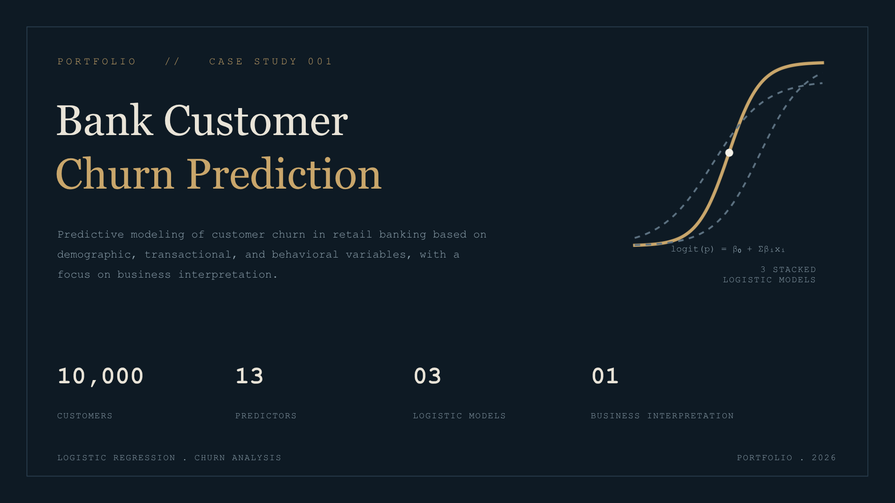
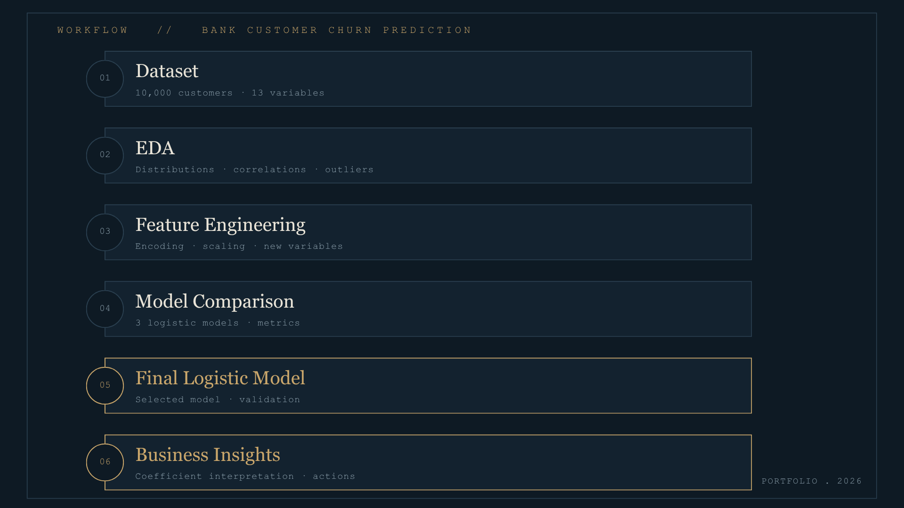
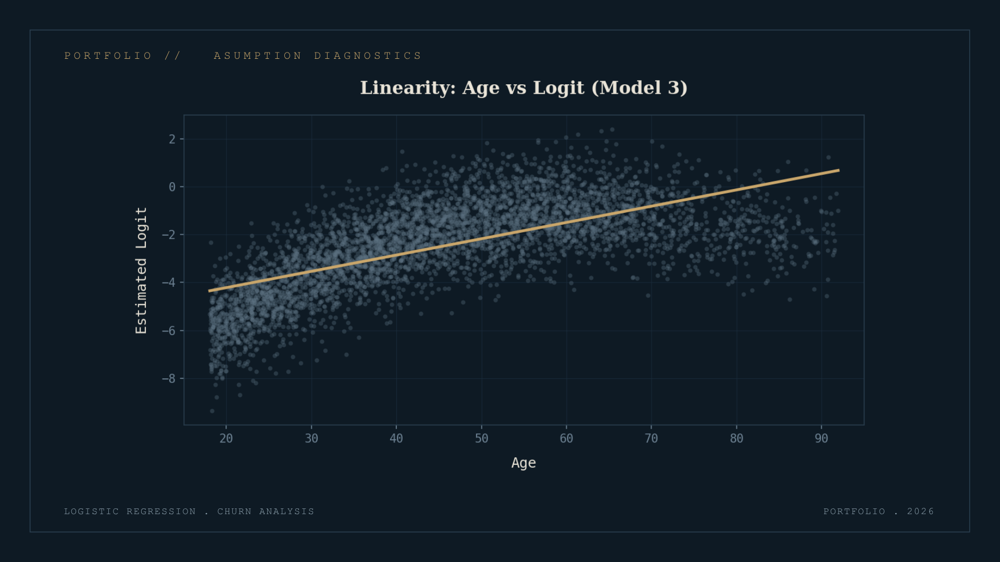
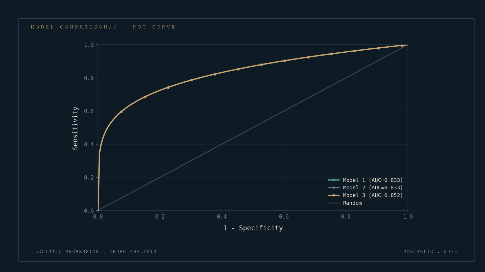

# Bank Customer Churn Prediction

  

Logistic regression model to predict **bank customer churn** using feature engineering, model comparison, and statistical validation in ***R***.

---

## Overview

Customer churn is one of the most important problems in the banking industry, as retaining an existing customer is considerably less expensive than acquiring a new one.

This project develops and compares several **logistic regression models** to identify the demographic and behavioral factors associated with customer attrition.

The analysis includes:

- Exploratory Data Analysis (EDA)
- Feature engineering
- Model comparison
- Interaction effects
- Nonlinear effects
- Model validation
- Odds ratio interpretation

>**Keywords:** Age², features engineering, interaction terms, Odds Ratio analysis, ROC Curve, Confusion Matrix & Likelihood Ratio Tests

---

## Objective

Develop and compare interpretable logistic regression models for customer churn prediction while evaluating the trade-off between predictive performance and business interpretability.

---

## Dataset 

- **Observations:** 10,000
- **Predictors:** 13
- **Response Variable:** `Exited`

>Dataset obtained from ***Kaggle***

Main variables include:

- Credit Score
- Age
- Geography
- Gender
- Balance
- Number of Products
- Active Member
- Estimated Salary

---

## Methodology

The project follows the following workflow:

  

---

## Main Findings

Some of the most relevant findings include:

- Within this dataset, age is the strongest, and perhaps only, predictor of customer churn.
- The relationship between age and churn is nonlinear.
- Customers from Germany exhibit significantly higher churn risk.
- Active members are substantially less likely to leave the bank.
- Customers with zero balance behave differently from customers with positive balances.
- Interaction effects between account balance and number of products improve model performance.

  

  

---

## Business Insights & Future Work

Although the final logistic regression model achieved better goodness-of-fit by incorporating categorical variables, interaction terms, and nonlinear effects, this project highlights an important trade-off between **predictive performance** and **business interpretability**.

From a practical perspective, the quadratic effect of **Age** emerged as the most informative predictor of customer churn. While additional categorical variables and interaction terms improved statistical performance, they also increased model complexity, making the resulting business interpretation less straightforward.

***The model with the highest statistical performance is not necessarily the most useful model for decision-making***

Regarding customers with **zero account balance**. Rather than treating account balance as a single continuous predictor, a more informative approach would be to analyze customers with zero balance separately from those maintaining positive balances. These groups likely represent different customer profiles and may exhibit distinct churn mechanisms. 

Finally, this study is based on **cross-sectional data**, which limits the ability to understand how customer behavior evolves over time. A longitudinal framework, tracking customers across multiple periods, would provide richer information about the dynamics leading to churn and could substantially improve both predictive performance and business understanding.

---

## Documentation

This repository includes:

- Complete R Markdown source code
- Full technical report (Spanish)
- Final presentation (Spanish)

> **Note:** The original report and presentation were prepared in Spanish as part of a graduate-level course in Statistical Methods in Finance.

---